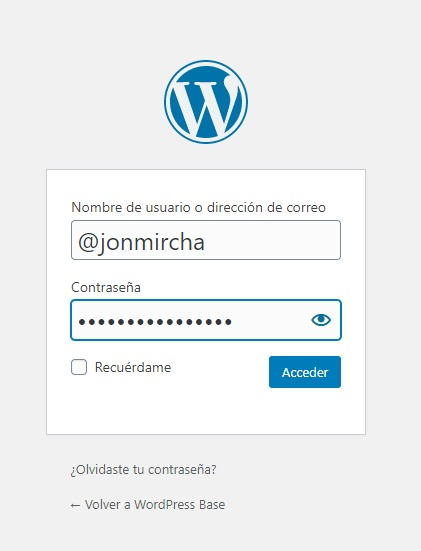
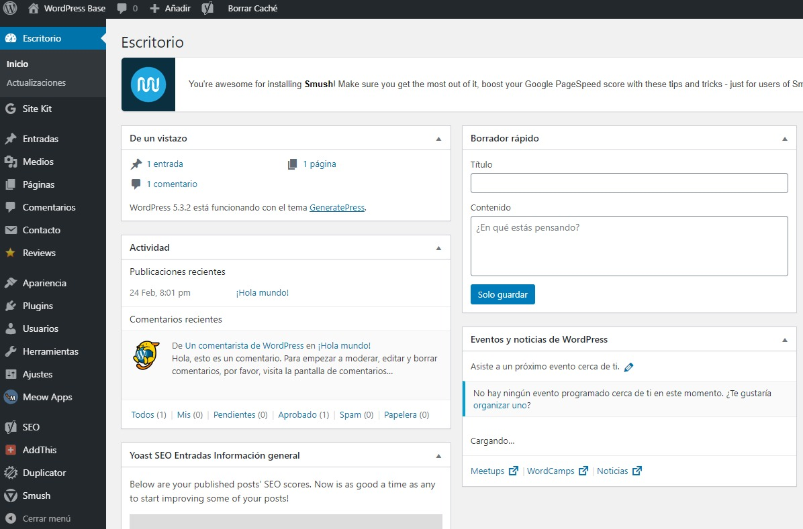

# _WordPress_

## Instalación

- Crear una cuenta de hospedaje gratis en [_Award Space_](https://www.awardspace.com/).
- Entra a tu [panel de administración](https://cp1.awardspace.net/) y:
  - Crea un subdominio gratis para tu sitio web.
  - Instala _WordPress_ desde la opción _Zacky App Installer_.
  - Se te pedirá un correo, usuario y contraseña para acceder a administrar tu sitio _WordPress_.
  - Para entrar al administrador de _WordPress_ ingresa el usuario y la contraseña que acabas de crear.
    
- ¡Felicidades! has instalado _WordPress_.
  
- Cada vez que quieras entrar a administrar tu sitio _WordPress_ a la _url_ de tu sitio, deberás agregarle **/wp-admin**.

          
          
          

## Ejemplos de Tiendas

- [De Calaveras](https://decalaveras.com/)
- [De Micrófonos](https://demicrofonos.com/)
- [De Relojes Inteligentes](https://relojes.inteligentes.com.es/)
- [De Relojes](https://relojes.fit/)
- [De productos de la India](https://deindia.net/)

          
          
          
