# Instalación de _WordPress_

- [Crear una cuenta en _000webhost_](https://www.000webhost.com/)
- Una vez logueado ve a **administar sitio**.
  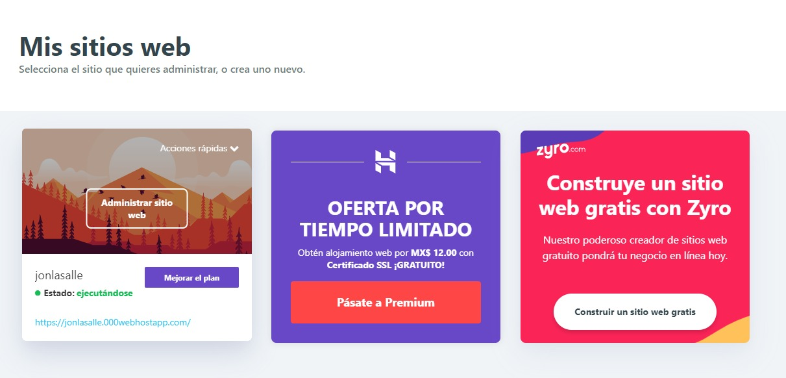
- Luego a **administador de archivos**.
  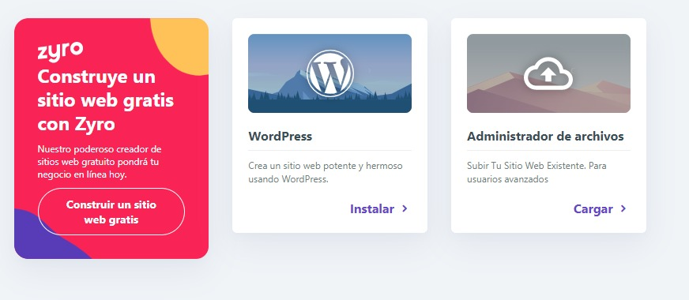
- Descargar los siguientes archivos y subirlos al **administador de archivos**:
  - [Archivo _zip_](../wp/20200224_wordpressbase_26d5908ec41fd09d7938_20200224231641_archive.zip)
  - [_installer.php_](../wp/installer.php)
    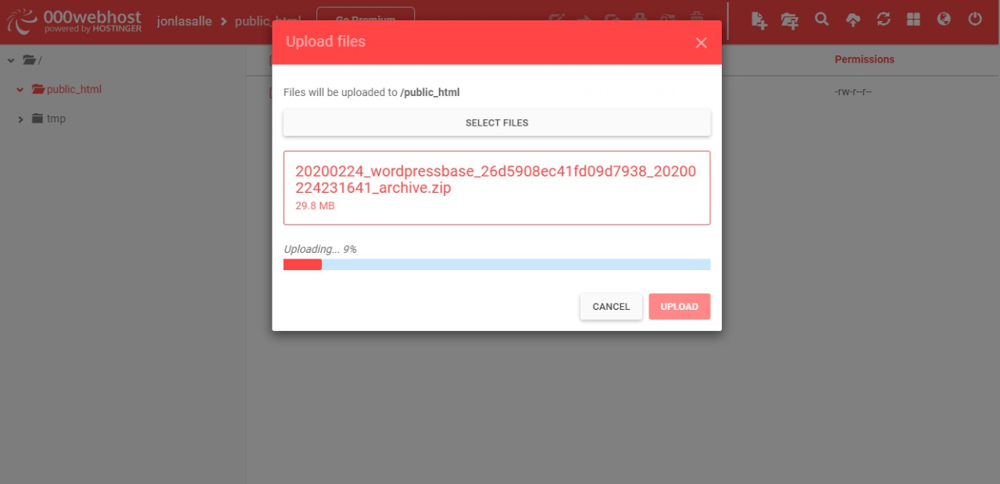
- Una vez que se suban ve a tu menú de opciones a **Herramientas**.
  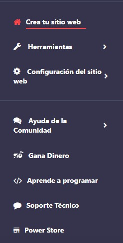
- Y luego a la opción **Administración de Base de Datos** y da clic en el botón **Nueva Base de Datos**.
  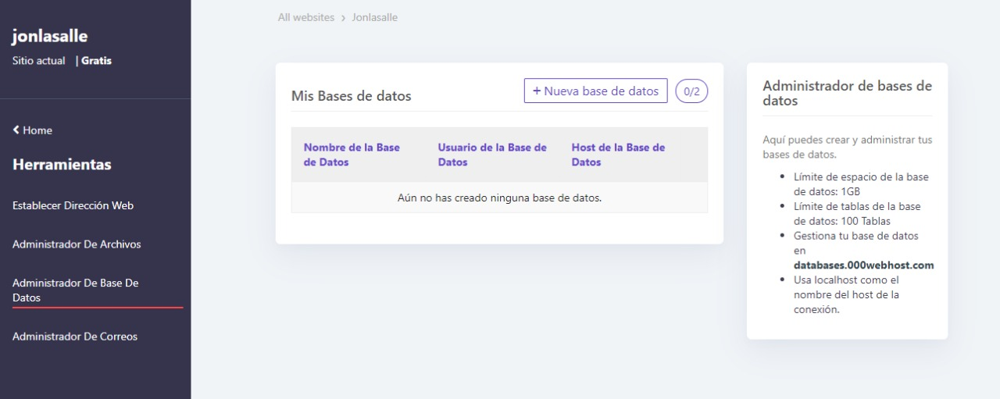
- Llena los datos que se te piden, **sólo usa minúsculas y guiones bajos**.
  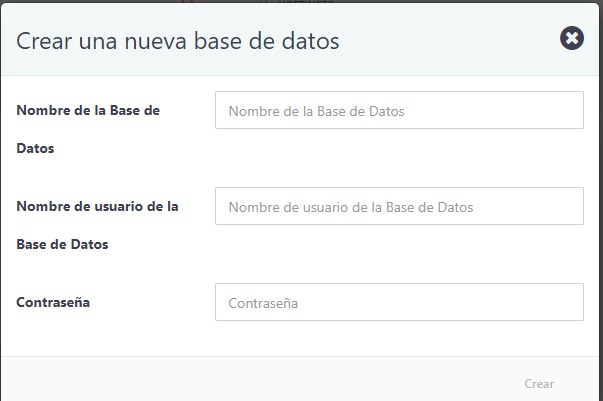
- Anota los datos que te apareceran en la siguiente pantalla, es una mezcla de los datos que ingresaste con un id aleatorio que te dará el sistema de _hosting_.
  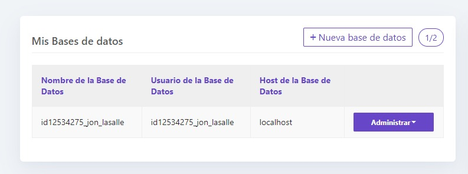
- Presiona el botón de **Mis Sitios**
  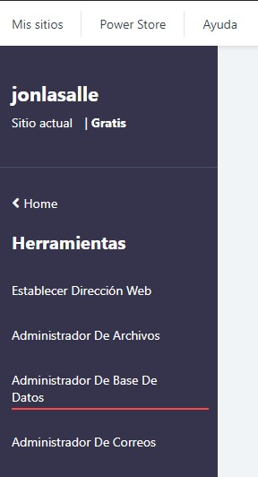
- Da clic en el enlace azul de tu sitio web, esa es la **URL de tu sitio**.
  
- En la barra de direcciones del navegador a la **URL de tu sitio** agregale el siguiente texto: _**/installer.php**_.
  
- Accederás a la siguiente página para instalar _WordPress_, presiona el _checkbox_ de terminos y condiciones, presiona **Next** y espera, el proceso puede tardar varios minutos.
  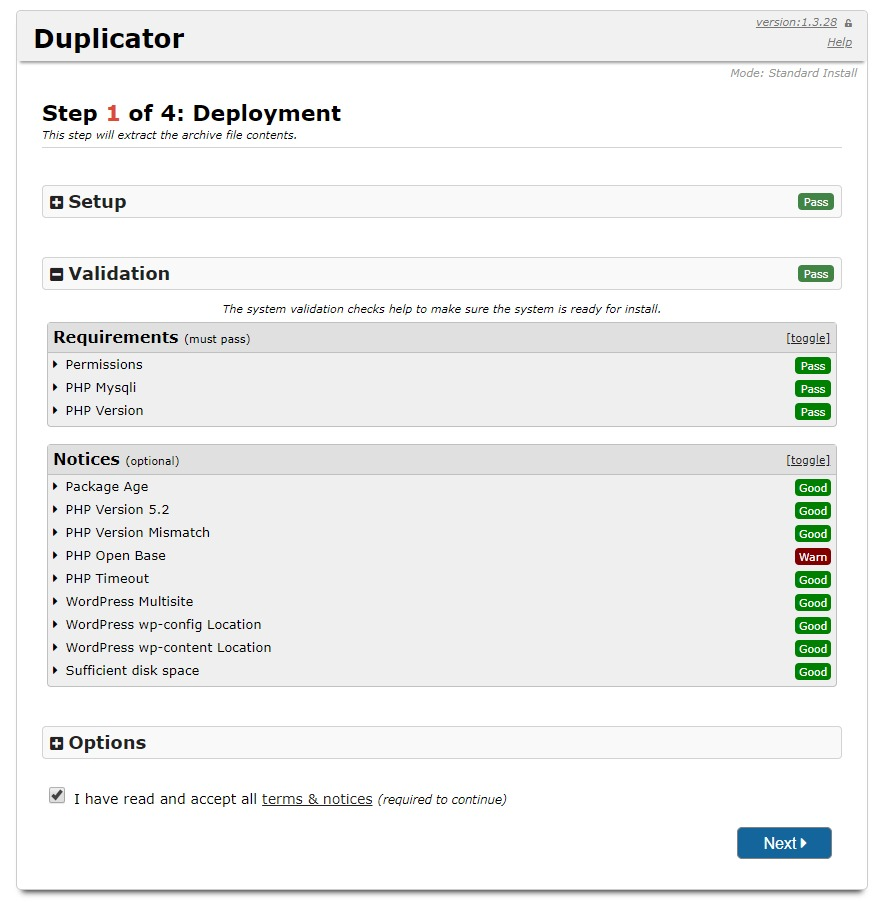
- En la siguiente pantalla escribe los datos de la base de datos que generaste en tu administrador de _hosting_, presiona el botón **Test Database**.
  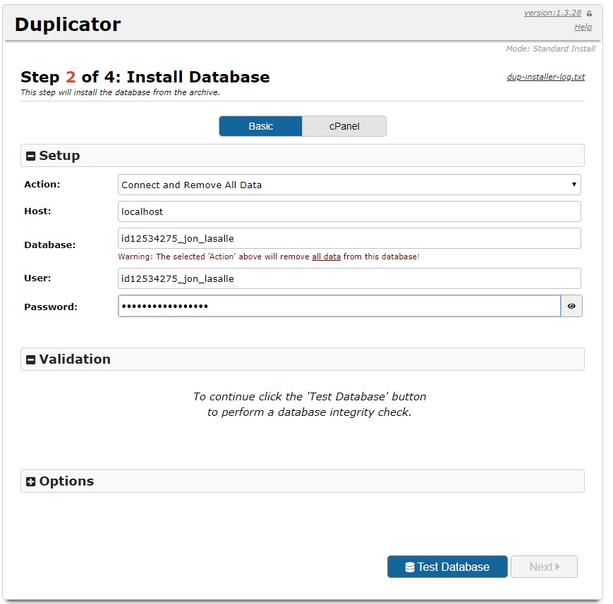
- Luego presiona el botón **Next** y espera la siguiente pantalla.
  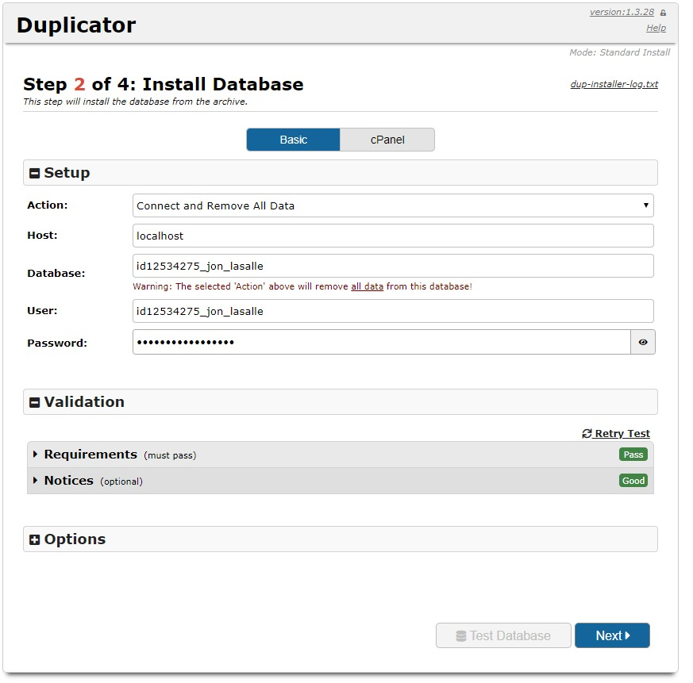
- Abre el acordeón de **Options** y crea un usuario administrador para acceder a tu _WordPress_. Cada vez que quieras acceder a la administración de tu sitio necesitarás ese usuario y contraseña. Ingresa usuario, contraseña y un correo que se asocie a tu usuario. Presiona **Next**.
  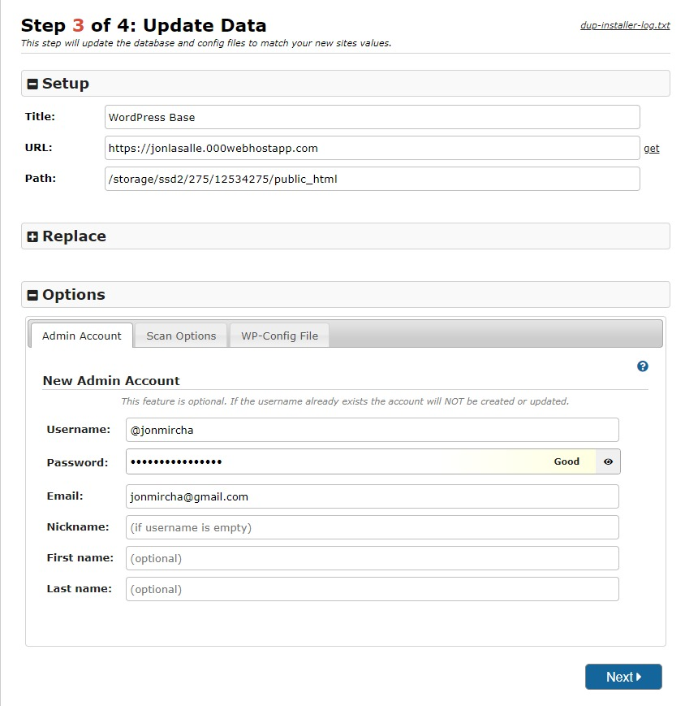
- Presiona el botón **Admin Login**.
  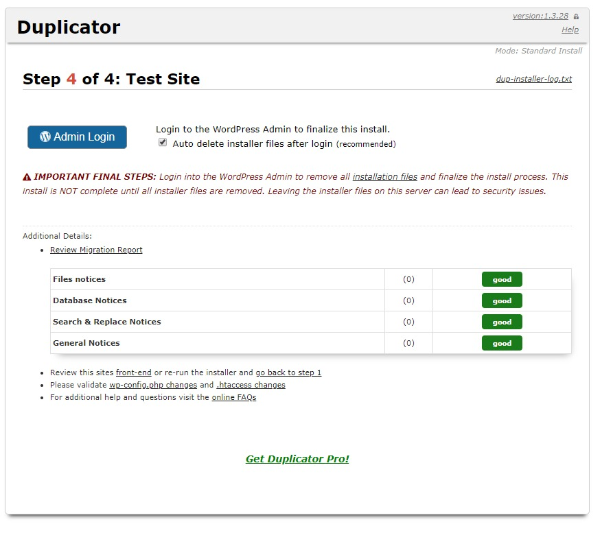
- Para entrar al administrador de _WordPress_ ingresa el usuario y la contraseña que acabas de crear hace 2 pantallas.
  
- ¡Felicidades! has instalado _WordPress_.
  

          
          
          
